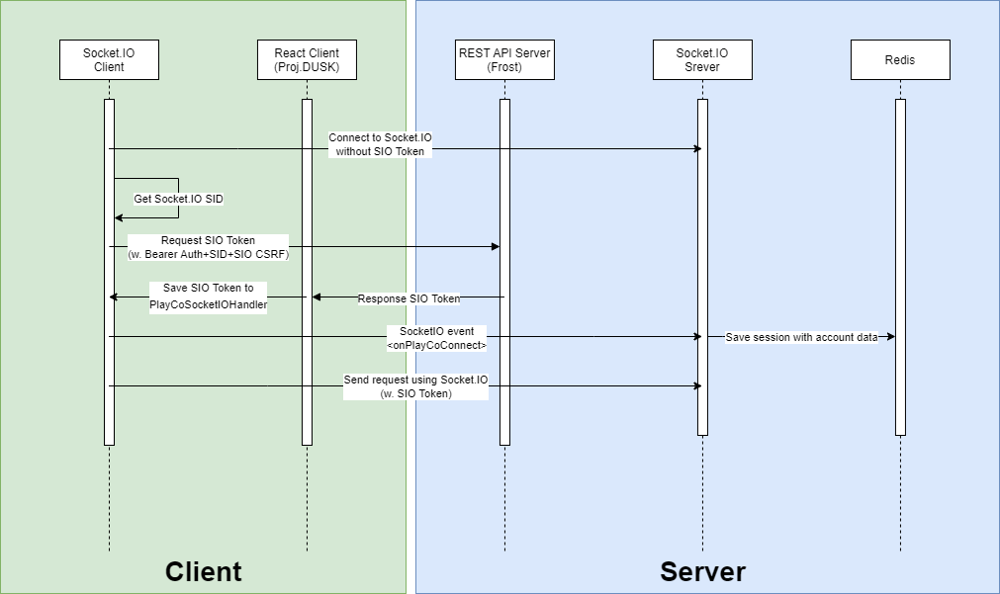

# [MUdev.cc](https://mudev.cc) 백엔드 저장소 <small><small>(근데 이제 [PlayCo](https://mudev.cc/playco)를 곁들인)</small></small>
> 이 프로젝트는 [MU-Software/frost](https://github.com/MU-software/frost)에 기반하고 있습니다. 관심이 있으시다면 한번 확인해보세요!   
> 더 적은 코드로 RESTful한 API를 작성하고, 문서 자동화를 경험하실 수 있어요!  

> [여기](README.md)에 영어 버전의 README가 있어요!  
> [Click here](README.md) to read a README written in English.  

> [여기](https://github.com/MU-Software/mudev_frontend)를 눌러 프론트엔드 저장소로 가실 수 있어요!  

이 곳은 [MUdev.cc](https://mudev.cc)와 하위 서비스인 [PlayCo](https://mudev.cc/playco)의 API 서버에 대한 코드 저장소입니다.  

* 현재 MUdev.cc는 NGINX 리버스 프록시 뒤에서 Gunicorn+Eventlet & SQLite & Redis 조합으로 돌아가고 있습니다.  
* Frost를 기반으로 작성되었으므로 환경 변수와 기타 설정은 [MU-Software/frost](https://github.com/MU-software/frost)를 참고해주세요.  
* MUdev.cc의 REST API 문서는 [여기](https://mudev.cc/doc/dev)를 참고해주세요. 단, 아직 Socket.IO에 대한 문서는 제공하지 않습니다.  

## [PlayCo](https://mudev.cc/playco)
PlayCo는 REST API와 Socket.IO를 활용해서 다른 사람들과 재생목록을 같이 보고, 수정하며, 누가 몇번째 영상을 보는지 공유하는 서비스입니다. 현재 로그인 된 사용자만 서비스를 이용할 수 있으며, 로그인하지 않은 사용자는 API를 사용할 수 없습니다. (비로그인 사용자를 위해서 준비 중이니 조금만 기다려주세요!)

### PlayCo의 Socket.IO 인증
상대방이 목록의 몇번째 영상을 보는지와 재생목록, 재생목록의 아이템이 수정되는 등의 이벤트는 Socket.IO를 통해 전달됩니다. 이 Socket.IO를 사용하기 위해서는 SIO 토큰을 발급받아서 매 Socket.IO 요청에 포함되어야 합니다. 이 문단에서는 Socket.IO의 인증에 관한 내용을 다룹니다.

1. 먼저 `/api/{API버전}/ws`라우트에 Socket.IO 라이브러리를 통해 접속합니다.
2. 접속한 Socket.IO 연결에서 `세션 ID`를 얻은 후, `/api/{API버전}/playco/socketio/auth` 라우트에 조금 전 얻은 `세션 ID`와 무작위 문자열로 구성된 `CSRF 토큰`을 요청 Body에 포함해서 Access 토큰을 사용한 Bearer 인증을 통해 POST 요청을 합니다. (`세션 ID`와 `CSRF 토큰`의 요청 body에서의 field 이름은 각각 `sid`와 `sio_csrf_token`입니다.)
3. 만약 인증이 성공적이라면, POST 요청에 대한 응답에 `data.sio_token.token`필드가 존재할 것입니다. 해당 필드의 값은 ***Socket.IO 인증 토큰***으로 사용될 것입니다.
Socket.IO 인증 토큰과 조금 전의 `sio_csrf_token`, 그리고 무작위 문자열인 `request_id`를 Socket.IO의 `playcoConnect` 이벤트로 보내주세요.(Socket.IO 인증 토큰 필드의 키 값은 `sio_token`입니다.) 인증이 성공적이면 Socket.IO 소켓에 `REQUEST_RESPONSE_{request_id}` 이벤트로 `SESSION_CREATED` 결과가 전송될 것입니다.
4. 이제 매 Socket.IO 요청의 body에 포함해주세요. 문제가 없다면 매 인증이 정상적으로 처리될 것입니다.
5. Socket.IO 인증 토큰의 인증 유효 시간은 1시간이며, 인증이 만료되었다면 2번만 진행해서 토큰을 재발급받은 후, 매 요청에 포함시켜 주세요. 재인증 시에도 기존 세션 기록은 보존됩니다.  

# 이슈
만약 문의사항이 있으시거나 버그를 찾으신 분은 Issue를 생성해주세요! 이슈는 언제나 환영이에요!
